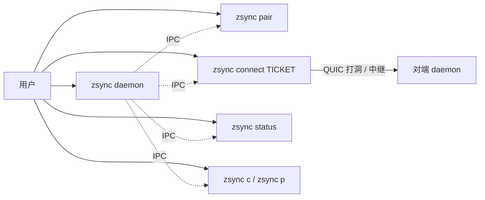
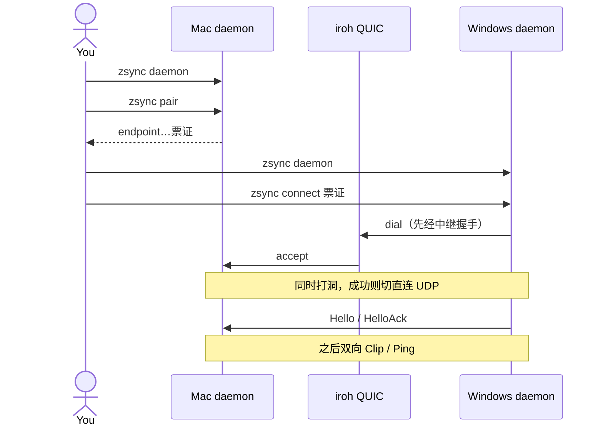
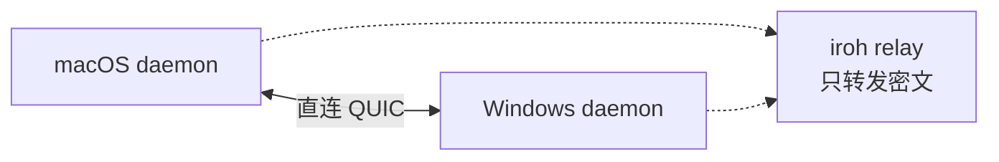
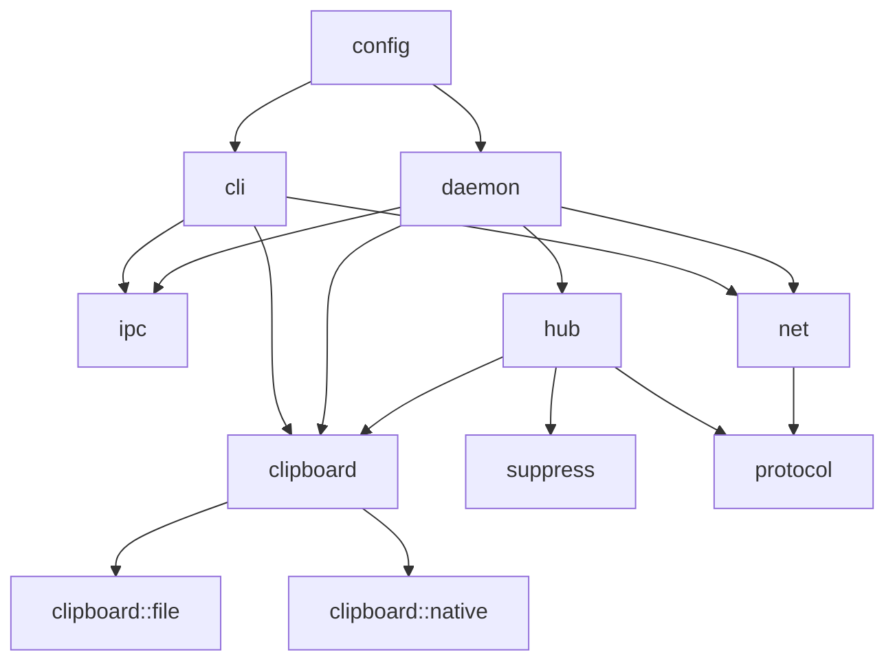
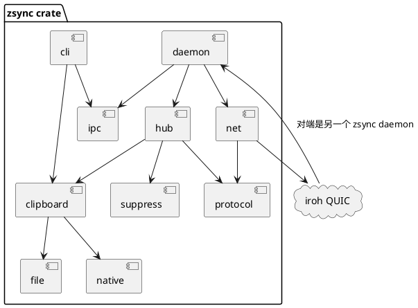
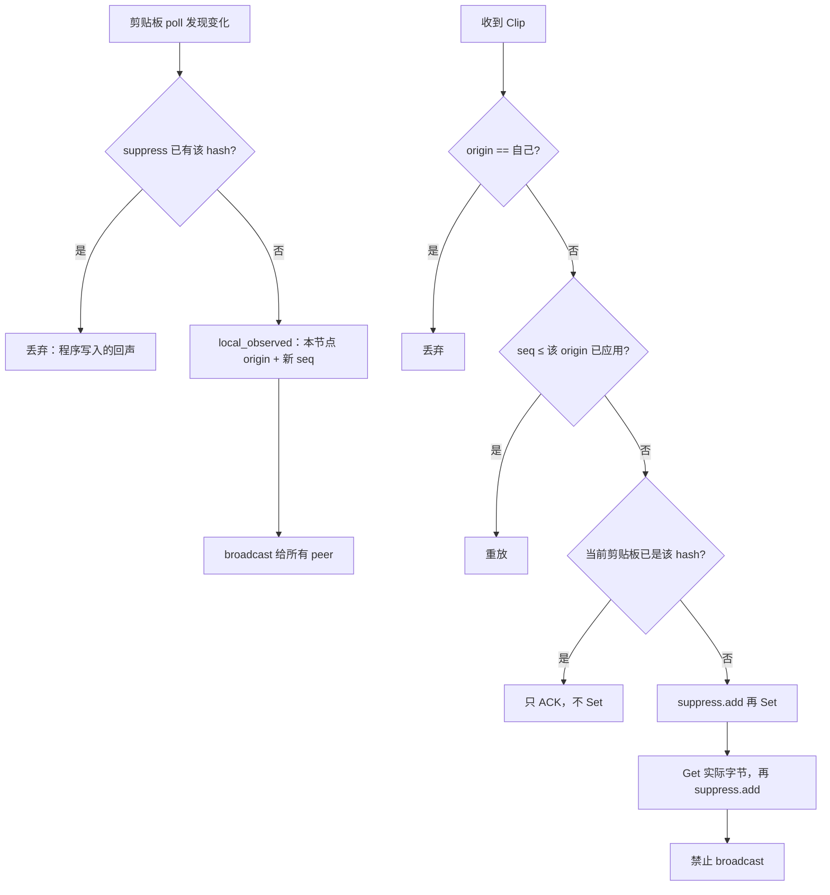
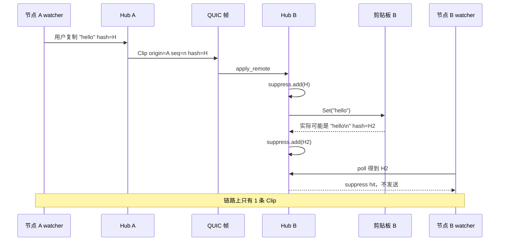
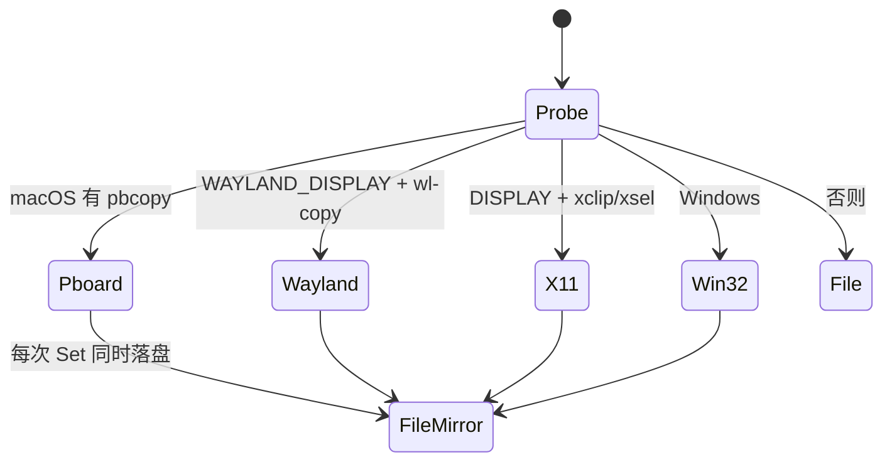
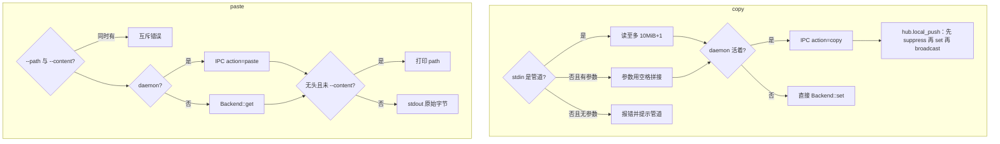
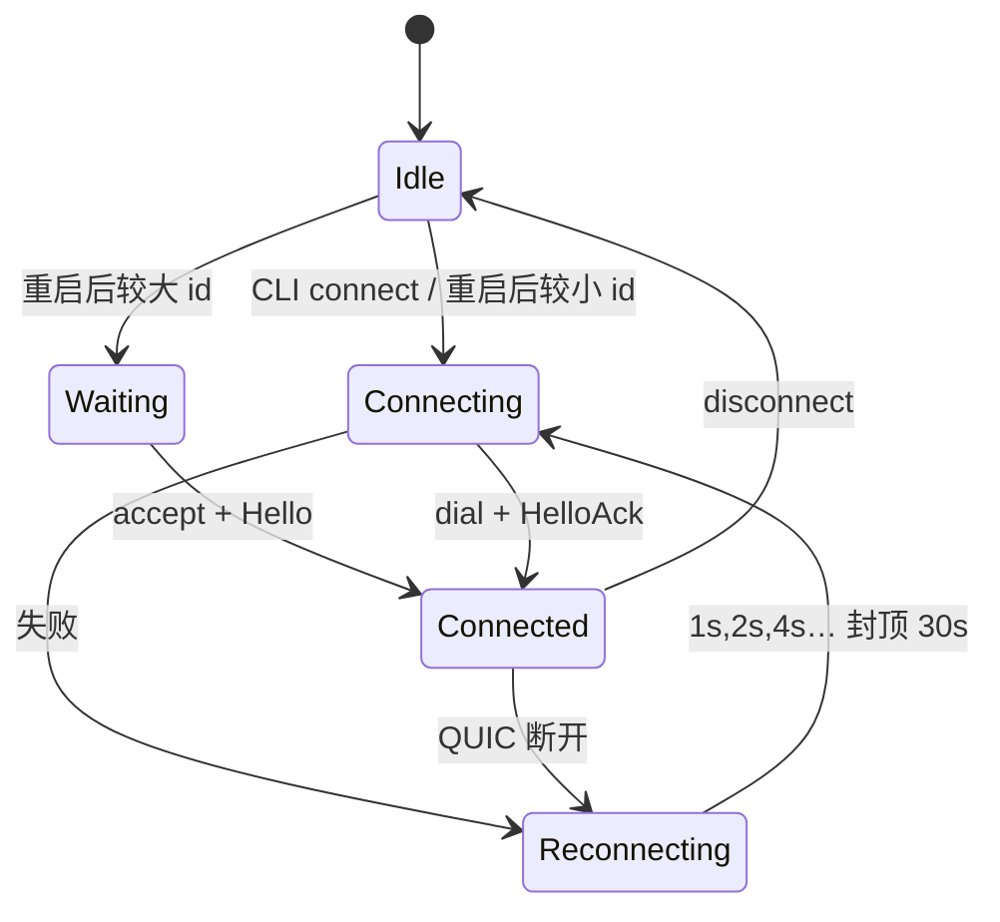

# zsync 架构设计

> [!NOTE] 文档状态
> **v0.2**：每台机器都是对等节点。主路径是 **iroh QUIC**：UDP 打洞直连，打不通则走端到端加密的公共中继。不需要自建 Linux 中转，也不走 SSH。
> 预览：`pagemd view -i docs/design/ARCH.md`。

**一句话**：两端各跑 `zsync daemon`，用票证配对；复制内容经 QUIC 同步，载荷 ≤ 10 MiB；无头节点落盘，粘贴打路径。

**不做**：不要求用户自建中转服务器、不把 RDP 当传输、不自己实现 STUN/ICE、不把剪贴板正文写进日志。

---

## 1. 问题与约束

两端各有一份剪贴板。用户在 A 复制，B 应在几百毫秒内得到同一份内容；B 再复制，A 同样更新。Windows 一般没有 sshd，不能再假设「找一台 Linux 当 Hub」。

| 约束 | 选择 |
|---|---|
| 传输 | iroh：QUIC/UDP 打洞，失败则加密中继 |
| 体积 | 单条载荷 ≤ 10 MiB，超出静默丢弃并记 status 错误 |
| 无头 | 无 GUI 时走文件后端；`zsync paste` 打出路径 |
| 守护进程 | 用户显式 `zsync daemon`，CLI 不偷偷拉起 |
| 递归 | 见 [§6](#6-回声抑制防复制循环)：origin + seq + suppress，且远端帧不回播 |

:::warning 核心风险是回声，不是带宽
A 写入 B 的剪贴板 → B 的 watcher 当成「本地新复制」→ 再发给 A → 无限振荡。协议必须把 **用户手势** 和 **程序写入** 分开。
:::

:::note 为什么不是「纯打洞、零服务器」
对称 NAT / 企业防火墙下，UDP 打洞会失败。成熟栈（iroh、libp2p DCUtR、WebRTC ICE）都保留 **信令 + 中继兜底**。iroh 的中继只转发已经 QUIC 加密的包，读不到剪贴板；这和「自己跑一台 Linux 当 zsync Hub」不是一回事。同一局域网通常直接打通，中继不参与数据面。
:::

---

## 2. 使用模型



| 命令 | 别名 | 谁执行 | 作用 |
|---|---|---|---|
| `zsync daemon` | | 本机 | 后台拉起守护进程，绑定 iroh Endpoint |
| `zsync daemon -f` | | 本机 | 前台跑，便于调试 |
| `zsync daemon stop` | | 本机 | 停守护进程 |
| `zsync pair` | | 本机 | 打印票证（EndpointId + 中继 + 直连地址） |
| `zsync connect …` | | 本机 | 票证 / `iroh://id` |
| `zsync disconnect [uri]` | | 本机 | 拆掉对端 |
| `zsync status` | | 本机 | 守护进程、票证、剪贴板、peer |
| `zsync copy` | `c` | 两端 | stdin 或参数 → 本地剪贴板，并作为 **本源 origin** 同步 |
| `zsync paste` | `p` | 两端 | GUI 打载荷；无头默认打路径 |

`copy` / `paste` 在 daemon 没起来时仍可走本机后端；`pair` / `connect` 必须有 daemon。

### 2.1 典型会话（Mac ↔ Windows）



### 2.2 为什么选 iroh，不自己打洞

Rust 上能用的栈：

| 库 | 成熟度 | 传输 | 打洞 | 打不通时 | 对 zsync |
|---|---|---|---|---|---|
| **iroh 1.x** | 高（1.0，crates.io 近 200 万下载） | QUIC/UDP | 内置 QNT | n0 公共中继，包已加密 | **主路径** |
| rust-libp2p | 高，但重 | TCP/QUIC | DCUtR | 要自己找 circuit relay | 对「一条可靠流」过重 |
| webrtc-rs / str0m | 媒体向 | ICE/UDP | ICE | 要自备 TURN | 信令与 TURN 都得自建 |
| quinn + STUN | 底层 | QUIC | 自己写 ICE | 没有 | 不重复造 |

可靠剪贴板需要有序、重传、流控。UDP 打洞之上用 QUIC，比「打出 TCP 再自己做可靠层」更贴现状：TCP 打洞成功率明显更差。

身份是 Ed25519 公钥（EndpointId），存在 `~/.zsync/secret`。票证用 `iroh-tickets` 打包 EndpointId + RelayUrl + 直连地址，复制粘贴一次即可。

### 2.3 Windows 与 RDP

Windows **没有 sshd 也能同步**：本机 `zsync daemon` 用 UDP 出站打洞（失败则走加密中继）。RDP 自带剪贴板重定向，与 zsync 无关。



| 场景 | 怎么连 |
|---|---|
| Mac ↔ Windows | 一边 `pair`，另一边 `connect` 票证 |
| 同一 Wi-Fi | 打洞后直连，中继退出数据面 |
| 两边都是对称 NAT | 会话留在加密中继上，功能仍可用 |
| Mac ↔ 无头 Linux | 两边都跑 daemon + 票证 |
| 人坐在 Mac 上 RDP 进 Windows | 要和家里 Mac 同步：在 **RDP 会话里的 Windows** 上跑 zsync，再 `connect` 票证 |

Hub 转发仍在：一台机器连了多个 peer 时，入口 peer 记为 `skip`，避免 A→本机→A。两台 GUI 直连时每边只有一条边，`apply_from` 不会绕回。

---


## 3. 进程与数据流

```diagram html
<div class="rounded-2xl border border-slate-200 bg-white p-5">
  <svg viewBox="0 0 960 420" class="w-full" role="img" aria-label="zsync 进程拓扑">
    <defs>
      <marker id="z-arrow" markerWidth="8" markerHeight="8" refX="7" refY="4" orient="auto">
        <path d="M1,1 L7,4 L1,7 Z" fill="#334155"/>
      </marker>
    </defs>
    <rect x="16" y="16" width="448" height="388" rx="20" fill="#f8fafc" stroke="#cbd5e1"/>
    <text x="40" y="48" fill="#0f172a" font-size="16" font-weight="700">本机（macOS / Windows / 有 GUI 的 Linux）</text>
    <rect x="40" y="68" width="400" height="56" rx="12" fill="#fff" stroke="#94a3b8"/>
    <text x="56" y="102" fill="#334155" font-size="14">zsync CLI  ·  pair / connect / c / p</text>
    <rect x="40" y="148" width="400" height="140" rx="12" fill="#fff" stroke="#0f172a"/>
    <text x="56" y="180" fill="#0f172a" font-size="15" font-weight="700">daemon</text>
    <text x="56" y="204" fill="#64748b" font-size="12">IPC：Unix socket 或 Windows named pipe</text>
    <text x="56" y="224" fill="#64748b" font-size="12">iroh Endpoint · 打洞 / 中继 / 重连</text>
    <rect x="56" y="240" width="168" height="32" rx="8" fill="#e2e8f0"/>
    <text x="68" y="261" fill="#334155" font-size="12">native clipboard</text>
    <rect x="236" y="240" width="184" height="32" rx="8" fill="#e2e8f0"/>
    <text x="248" y="261" fill="#334155" font-size="12">~/.zsync/clips/ 镜像</text>
    <path d="M240 124 V148" stroke="#334155" stroke-width="1.6" marker-end="url(#z-arrow)"/>
    <text x="248" y="140" fill="#64748b" font-size="11">daemon.sock / named pipe</text>

    <path d="M464 218 H496" stroke="#334155" stroke-width="1.8" marker-end="url(#z-arrow)"/>
    <text x="472" y="208" fill="#0f172a" font-size="11">QUIC</text>
    <text x="472" y="236" fill="#64748b" font-size="11">ZSYN frames</text>

    <rect x="496" y="16" width="448" height="388" rx="20" fill="#f8fafc" stroke="#cbd5e1"/>
    <text x="520" y="48" fill="#0f172a" font-size="16" font-weight="700">对端（Windows / Mac / Linux）</text>
    <rect x="520" y="68" width="400" height="220" rx="12" fill="#fff" stroke="#0f172a"/>
    <text x="536" y="100" fill="#0f172a" font-size="15" font-weight="700">对端 zsync daemon</text>
    <text x="536" y="124" fill="#64748b" font-size="12">同一套 Hub + 剪贴板 + 帧协议</text>
    <text x="536" y="144" fill="#64748b" font-size="12">accept 入站 / 或被票证 dial</text>
    <rect x="536" y="168" width="176" height="36" rx="8" fill="#e2e8f0"/>
    <text x="548" y="191" fill="#334155" font-size="12">native / file</text>
    <rect x="728" y="168" width="168" height="36" rx="8" fill="#e2e8f0"/>
    <text x="740" y="191" fill="#334155" font-size="12">iroh Endpoint</text>
    <rect x="536" y="220" width="360" height="48" rx="8" fill="#fff" stroke="#94a3b8"/>
    <text x="552" y="242" fill="#334155" font-size="12">对端 zsync c / p / status / pair</text>
    <text x="552" y="258" fill="#64748b" font-size="11">无头时粘贴打印 clips/current.* 路径</text>
    <text x="520" y="320" fill="#64748b" font-size="12">直连 UDP；失败则中继只转发密文</text>
  </svg>
</div>
```

载荷在链路上只出现一次：**origin 节点发出 Clip，对端 Apply 后不再回播**。Watcher 看到的程序写入靠 suppress 吞掉。

---

## 4. 模块

实现是单个 Rust crate `zsync`：`src/main.rs` 进 tokio，逻辑在库里，便于测 Hub / 协议。



| 模块 | 职责 | 禁止做的事 |
|---|---|---|
| `cli` | clap 解析；copy/paste 读写 stdin/stdout | 不自己维持 QUIC |
| `daemon` | 进程生命周期、IPC、accept/dial | 不解析帧 |
| `hub` | 本地观察 / 本地 push / 远端 apply / broadcast | 不直接 dial |
| `protocol` | 帧编解码、MIME 嗅探、hash | 不碰剪贴板 |
| `suppress` | hash TTL+ring、origin seq | 无 IO |
| `clipboard` | `Backend` trait；native 或 file | 不发网络 |
| `net` | iroh Endpoint、票证、peer URI | 不解释 Clip |
| `ipc` | Unix socket / named pipe 上一行 JSON + body | 不打日志写 body |
| `config` | `~/.zsync` 路径、secret、state.json | |



`clipboard::open(dir)` 的选择顺序：macOS `pbcopy/pbpaste` → Linux Wayland `wl-*` → X11 `xclip`/`xsel` → **file**。native 成功时仍把同一份载荷镜像进 `~/.zsync/clips/`，这样 `--path` 在 GUI 上也能用。

---

## 5. 帧协议

魔数 `ZSYN`（`0x5A53594E`），大端，version = 1。跑在 QUIC 流上，链路已可靠，不加 CRC。

```
 0               4     5      6              10
 +---------------+-----+------+---------------+
 | magic "ZSYN"  | ver | type | payload_len   |
 +---------------+-----+------+---------------+
 | payload  (len bytes)                       |
 +--------------------------------------------+
```

| type | 名字 | payload |
|---|---|---|
| 1 | Hello | JSON：node_id, hostname, os, headless, version, max_bytes |
| 2 | HelloAck | 同上（对端身份） |
| 3 / 4 | Ping / Pong | 空或 unix 毫秒时间戳 |
| 5 | Clip | `u16be meta_len` + ClipMeta JSON + 原始字节 |
| 6 | ClipAck | JSON：hash, ok, reason |
| 7 | Error | JSON：code, message |
| 8 | Bye | 空 |

ClipMeta：

```json
{
  "origin_id": "iroh endpoint id hex",
  "seq": 42,
  "mime": "text/plain",
  "hash": "sha256 hex",
  "size": 11
}
```

`size` 必须等于尾随字节数。`hash` = SHA-256(data)。单帧 payload ≤ 10 MiB + 64 KiB 头空间；meta JSON ≤ 16 KiB。

握手不对称：**发起 QUIC 双向流的一侧先发 Hello，对端回 HelloAck**。随后任一侧可发 Clip / Ping。Ping 间隔 30s。

:::note MIME
watcher 优先纯文本；仅当系统声明只有图像时才走 `image/png`。`zsync copy` 对 stdin 做魔数嗅探（PNG/JPEG/GIF / UTF-8 / octet-stream）。
:::

### 5.1 CLI ↔ daemon 的 IPC

Unix socket `~/.zsync/daemon.sock`（Windows：`\\.\pipe\zsync`，并用 sock 路径写一个标记文件）。每条消息是 **一行 JSON + `n` 字节原始 body**（不是 ZSYN 帧）。

| `action` | 方向 | body |
|---|---|---|
| `status` | CLI → daemon | 空；响应带 `status` 对象 |
| `connect` / `disconnect` | CLI → daemon | 空；`uri` 在 JSON 里 |
| `copy` | CLI → daemon | 载荷字节 |
| `paste` | CLI → daemon | 空；GUI 响应 body 为载荷，无头默认只给 `path` |

运行时间隔写在 `Config::default()`：poll 300 ms、debounce 200 ms、suppress TTL 5 s。暂不读配置文件。

---

## 6. 回声抑制（防复制循环）

一条 Clip 有三个身份字段：**谁第一次复制**（`origin_id`）、**他的第几次**（`seq`）、**内容指纹**（`hash`）。再加上本节点的 suppress 表。



### 6.1 必须按这个顺序 Apply

1. `seen.accept(origin, seq)` —— 失败则 ACK `duplicate`，不写剪贴板。
2. `suppress.add(hash)` —— **先于** `Backend::set`，避免 watcher 抢跑。
3. `set`。
4. 立刻 `get`，把 **操作系统改写后的实际 hash** 再 `suppress.add`（macOS 有时会加换行、转 PNG）。
5. **不要** 把这条 Clip 放进 broadcast。二节点下回声只能来自 watcher；多 peer 以后如要转发，也只能转给「非来源」的边，且保留原 `origin_id`。



[^os-transform]: 这是回声最常见的漏网：按发送 hash 抑制，但 Set 之后 Get 对不上。所以 Apply 后必须再吃一遍实际内容。

### 6.2 无头路径投影不得进入同步

无头 `Set` 把载荷写到 `clips/objects/{hash}` 和 `clips/current{ext}`。`Get` 返回的是 **载荷字节**，不是路径字符串。`zsync paste` 才打印路径。

:::danger 若把路径写进被 watch 的 native 剪贴板
Server 收到一张图 → 剪贴板变成 `/home/u/.zsync/clips/current.png` → watcher 把这段文字同步回 Mac → Mac 上的图被路径覆盖。Hub 禁止同步「投影」。
:::

Debounce：poll 间隔默认 300 ms；hash 变化后再等 200 ms 取稳定快照，合并一次粘贴产生的多次通知。

`seq` 持久化在 `state.json`，避免重启后从 0 开始被对端当成重放丢掉。

---

## 7. 剪贴板后端



| 后端 | `headless()` | `get/set` | `paste` 默认 |
|---|---|---|---|
| native（pboard / wayland / xclip / xsel / win32） | false | 系统剪贴板 | 载荷字节，不额外加换行 |
| file | true | `clips/objects` + `current.*` | 绝对路径 + 换行 |

`Item`：`mime` / `data` / `hash` / `path`。`path` 只是本地投影，**不进 Clip 帧**。

无头 Linux 没有 X11 剪贴板。vim / tmux / zmux 的接法见 `zsync help`（`--help` 文末）。`zsync xclip` 兼容 xclip 的 `-i`/`-o`。`zsync p` 默认打路径；编辑器必须用 `zsync p --content`。

---

## 8. copy / paste



`local_push` 与 watcher 的 `local_observed` 共用「打 origin + seq + 广播」；差别是 push 自己 `set`（并预先 suppress），observed 假定内容已在剪贴板上。

---

## 9. 数据目录

全部在 `~/.zsync/`（权限 0700）。不跟 XDG 拆开，两端路径一致。

| 路径 | 用途 |
|---|---|
| `node_id` | iroh 公钥（与 EndpointId 相同） |
| `secret` | 32 字节密钥的 hex，权限 0600 |
| `daemon.sock` | CLI 的 Unix socket；Windows 上为 named pipe 标记文件 |
| `daemon.pid` | 守护进程 pid |
| `daemon.log` | 后台日志；禁止写载荷 |
| `state.json` | `seq` + 已保存 peers |
| `clips/objects/{sha256}` | 内容寻址载荷 |
| `clips/current.{txt,png,…}` | 给 paste 用的稳定路径 |
| `clips/current.json` | 当前 hash/mime/path |

`state.json` 示例：

```json
{
  "seq": 12,
  "peers": [{ "uri": "iroh://<endpoint-id>", "enabled": true }]
}
```

daemon 启动时对 `enabled` 的 peer 自动重连。`disconnect` 从列表删除。

---

## 10. P2P 连接与重连

daemon 启动时绑定 iroh Endpoint（`presets::N0`：公共中继 + DNS 地址查找），ALPN = `zsync/1`。`pair` 在 `online()` 之后打印 `EndpointTicket`。

`connect` 接受：

- 票证（`endpoint…` 字符串）
- `iroh://<endpoint-id>`

同一对 Endpoint 只跑一条 framed 会话（`live` 集合按对端 id 去重）。用户执行的 `connect` **强制 dial**；重启后仅当本机 id 字典序更小才 dial，另一侧只 accept，避免双向互拨拆成两条半连接。



`status` 里 peer 的 `last_sync` 是 Unix 秒时间戳（字符串）。

---

## 11. 安全

- 主路径信任边界 = iroh 公钥：只有拿得到票证或 EndpointId 的人能 dial；QUIC/TLS 用该密钥做身份。
- 公共中继只转发密文，看不到 Clip。
- 日志只记 hash 前 12 位、字节数、MIME、peer URI，不记正文。
- 不实现「任意文件上传」：只同步剪贴板载荷；无头落盘目录仅 zsync 自己写。
- IPC：Unix 上 socket 权限靠 0700 家目录；Windows named pipe 默认对本用户。`secret` 文件 0600。

---

## 12. 源码映射

对照实现（改代码后回写本节）。单 crate。

| 设计块 | 文件 |
|---|---|
| 入口 / tracing | `src/main.rs` |
| CLI 与 `c`/`p` / `pair` | `src/cli.rs` |
| 协议帧 | `src/protocol.rs` |
| suppress / seq | `src/suppress.rs` |
| Hub（observed / push / apply，不回播远端） | `src/hub.rs` |
| daemon / accept / dial / watcher | `src/daemon.rs` |
| iroh 票证与 Endpoint | `src/net.rs` |
| IPC JSON+body | `src/ipc.rs` |
| 路径、secret、state.json | `src/config.rs` |
| Backend trait / Memory 测试后端 | `src/clipboard/mod.rs` |
| 无头文件 | `src/clipboard/file.rs` |
| macOS pboard / Linux wl+xclip / Windows | `src/clipboard/native.rs` |

```bash
cargo build --release
# 机器 A
zsync daemon
zsync pair
# 机器 B（把 A 打印的票证贴过来）
zsync daemon
zsync connect endpoint…
echo hello | zsync c
zsync p
zsync status
```

---

## 13. 以后

Android（需常驻 App）、iOS（无后台剪贴板监听，只能分享扩展或手动 `zsync c`）。Windows 图像剪贴板（DIB/PNG）可在文本通路稳定后再加。自建 iroh relay（完全不依赖 n0 公共中继）可作为可选项。

